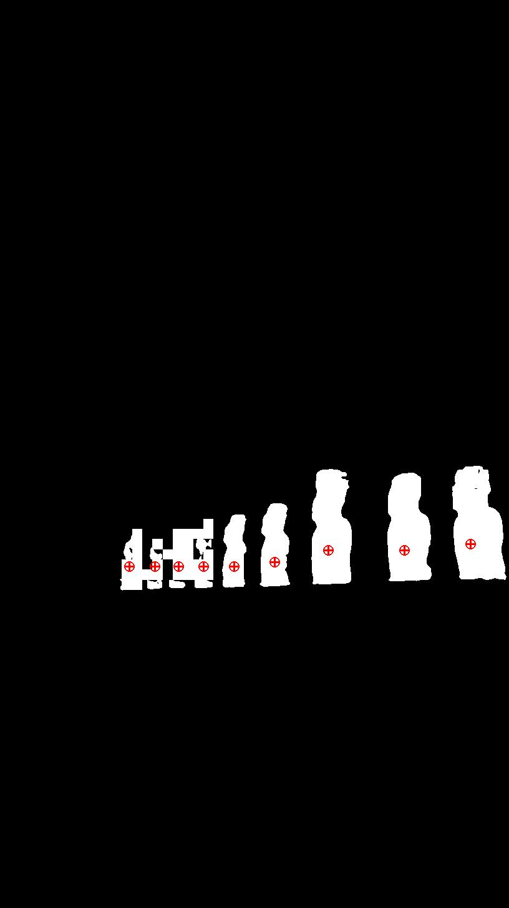

# Vlaser VLM Quick Start

Since Vlaser VLM is trained by supervised finetuning (SFT) upon InternVL3, all the training and inference procedure adopt the same as [InternVL3](https://internvl.readthedocs.io/en/latest/internvl3.0/quick_start.html). For ease of use, we list the key processes including environment setup, training and inference steps here. If you encounter other sort of questions, please refer to [InternVL-series](https://github.com/OpenGVLab/InternVL/tree/main) at first.

## 🛠️ Installation

- Create a conda virtual environment and activate it:

  ```bash
  conda create -n internvl python=3.9
  conda activate internvl
  ```

- Install dependencies using requirements.txt:

  ```bash
  pip install -r requirements.txt
  pip install flash-attn==2.3.6 --no-build-isolation
  ```

## 📦 Training

Vlaser VLM is trained by performing the second supervised finetuning (SFT) upon InternVL3. If you want to train the model from scratch on your own, please create your own meta_data.json using the same format like [this](./internvl_chat/shell/data/internvl_1_2_finetune_custom.json) as the argument pass to `--meta_path` in the following shell script. The format for each specific JSONL (such as plain text data, single-image data, multi-image data, video data) can be organized according to the descriptions provided in [this document](https://internvl.readthedocs.io/en/latest/get_started/chat_data_format.html).


- Run Training scripts:

  ```bash
  cd internvl_chat
  # for Vlaser-2B
  bash shell/internvl3.0/2nd_finetune/internvl3_2b_dynamic_res_2nd_finetune_full.sh 
  # for Vlaser-8B
  bash shell/internvl3.0/2nd_finetune/internvl3_8b_dynamic_res_2nd_finetune_full.sh 
  ```


| model name               |    type     | download                                                                                   |  size   |
| ------------------------ | :---------: | ------------------------------------------------------------------------------------------ | :-----: |
| InternVL3-2B |   huggingface   | 🤗 [HF link](https://huggingface.co/OpenGVLab/InternVL3-2B) | 4.2 GB |
| InternVL3-8B       | huggingface | 🤗 [HF link](https://huggingface.co/OpenGVLab/InternVL3-8B)                          | 15.9 GB |

Please download the above model weights first and pass the download path to  `--model_name_or_path` argument in the shell script.


## 📊 Evaluation
We use `transformers` (transformers==4.54.0) as the inference architecture. We provide the example inference code for Vlaser, including single-image single-round conversation, single-image multi-round conversation and multi-image multi-round conversation in [eval_example.py](./internvl_chat/eval/eval_example.py). Please insert the evaluation part of code to the corresponding official implementation of the following embodied reasoning benchmarks: [ERQA](https://github.com/embodiedreasoning/ERQA), [Ego-Plan2](https://github.com/qiulu66/EgoPlan-Bench2/), [Where2place](https://github.com/wentaoyuan/RoboPoint), [Pointarena](https://github.com/pointarena/pointarena), [VSIBench](https://github.com/vision-x-nyu/thinking-in-space), [RefSpatial](https://github.com/Zhoues/RoboRefer), [MMSIBench](https://github.com/InternRobotics/MMSI-Bench), [VLABench](https://github.com/OpenMOSS/VLABench) and [EmbodiedBench](https://github.com/EmbodiedBench/EmbodiedBench). We also provide the self-implemented evaluation script for [Pixmo-Points](./internvl_chat/eval/evaluate_point_pixmo.py) and [Paco-Lavis](./internvl_chat/eval/evaluate_point_paco.py) in `internvl_chat/eval`. 

### Important Notes:
For benchmarks that require point grounding capability, please add the following prefix to the question itself for fully reproduction:

```
You are InternVL. Your task is to locate several points in the given image according to the task descriptions. Your answer should be formatted as \"<point>[[x1, y1], [x2, y2],...]</point>\". The point coordinates are normalized to integers between 0 and 1000. Return the answer in the point format directly.
```

For example:

<!DOCTYPE html>
<html lang="en">
<body>
    <div class="content">
        <!-- Left image container -->
        <div class="image-container">
            
        </div>
        <!-- Right image container -->
        <div class="image-container">
            
        </div>
    </div>
    <div class="content">
        <!-- Left image container -->
        <div class="image-container">
            <p><strong>Question:</strong> You are InternVL. Your task is to locate several points in the given image according to the task descriptions. Your answer should be formatted as \"&lt;point>[[x1, y1], [x2, y2],...]&lt;/point>\". The point coordinates are normalized to integers between 0 and 1000. Return the answer in the point format directly. Point to all the moai.
            </p>
        </div>
        <!-- Right image container -->
        <div class="image-container">
            <p><strong>Answer:</strong> &lt;point>[[254, 624], [304, 624], [351, 624], [400, 624], [460, 624], [540, 619], [645, 606], [795, 606], [925, 599]]&lt;/point> </p>
        </div>
    </div>
</body>
</html>


You need to extract the point coordinates within `<point></point>` and transform to the ordinary coordinates in width and height as the post-processing procedure.
```python
def text2pts(text, img_path):
    width, height, = Image.open(img_path).size
    pattern = r"<point>\s*\[\s*(\[.*?\])\s*\]</point>"
    match = re.search(pattern, text, re.DOTALL)
    points = []
    if match:
        points_str = match.group(1)
        # 匹配所有[x, y]对
        coord_pattern = r"\[\s*(\d+)\s*,\s*(\d+)\s*\]"
        coords = re.findall(coord_pattern, points_str)
        for x_str, y_str in coords:
            x = int(x_str)
            y = int(y_str)
            # 归一化到图像尺寸
            x = int(x / 1000 * width)
            y = int(y / 1000 * height)
            points.append((x, y))
    return np.array(points)
```

